
# Resume 💼🏢💻📄🗂📎🗄️🏦📠🖇🖨📱📧

You will utilize GitHub Pages to create a host your resume Frank

## Part 1 - Instructions

You will have to create this project from scratch using plain HTML, JavaScript, and CSS.

This website will include:

* At least four pages that you can navigate to, consider index, about me, projects, socials, bio, demo real, portfolio, etc.
* Have at least two interactive JavaScript components that alter the view but are also accessible with a keyboard. Consider a button to switch between light and dark mode themes, a switch to change languages from English to Spanish, something to change the font sizes, go to high contrast mode, etc.
* Include a professionally written, styled, and presented resume. Visit with the career services people to have them look it over.
* Create your own favicon.
* Publish your website onto GitHub Pages.

You can utilize open-source CSS, but it must be cited and adapted to your needs.

Be sure that you have:

* Validated your HTML using [validator.w3.org](https://validator.w3.org/) to ensure no errors nor warnings.
* Verify that you are well documenting your code using [JSDoc](https://www.npmjs.com/package/jsdoc) standards. You do not need to generate an API.
* Ensured that you write satisfactory unit tests and that your code passes them, with **75%** coverage for non-view related tests.
* Include View Testing with puppeteer to ensure your website is updating as expected.
* Test your color contrast by visiting [a11y.com](https://color.a11y.com/).

**Optional**:

Purchase a domain name for your site and link it to your GitHub pages. I've used Google Domains, recently purchased by SquareSpace, with usually costs $1 for a domain name such as [www.oscarveliz.com](www.oscarveliz.com) and it is always a good idea to at least grab your name before someone else does. See [https://docs.github.com/en/pages/configuring-a-custom-domain-for-your-github-pages-site/managing-a-custom-domain-for-your-github-pages-site](https://docs.github.com/en/pages/configuring-a-custom-domain-for-your-github-pages-site/managing-a-custom-domain-for-your-github-pages-site) for more information on how to do this.

## Part 2 - Reflection

Add screenshots below showing,

* Your app running on GitHub Pages
* Your html validation
* Your code coverage
* Your view testing

https://cs5610-seattle-fall23.github.io/resume-frankluo123/ 
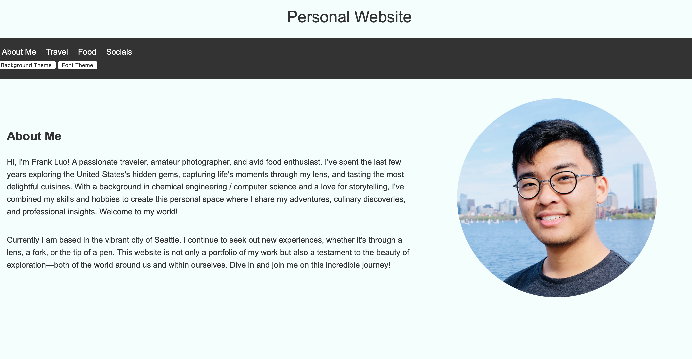
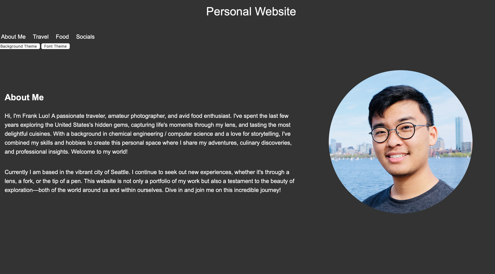
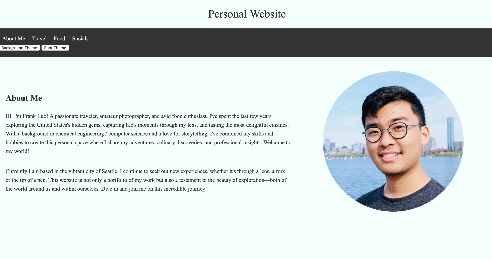
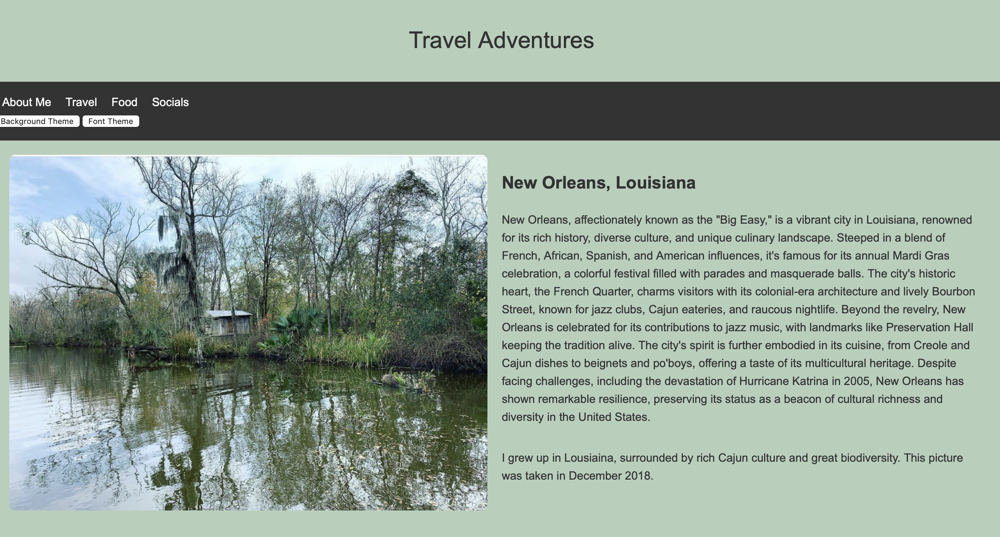
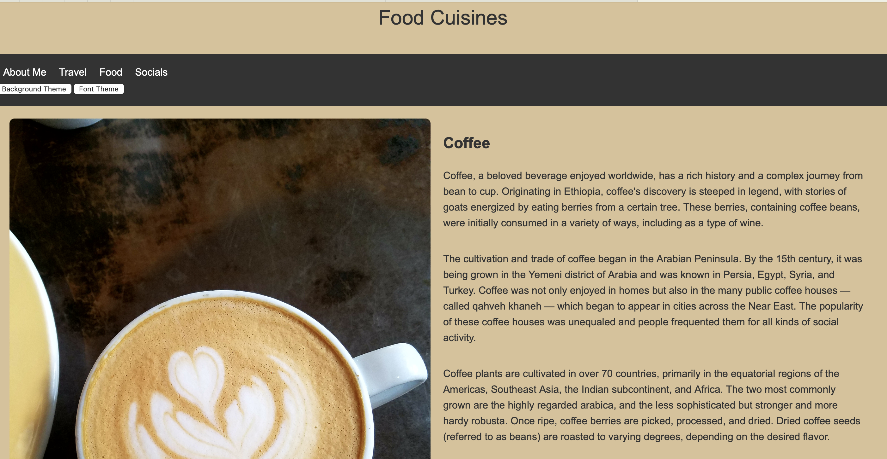
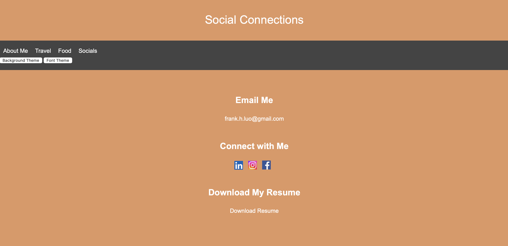
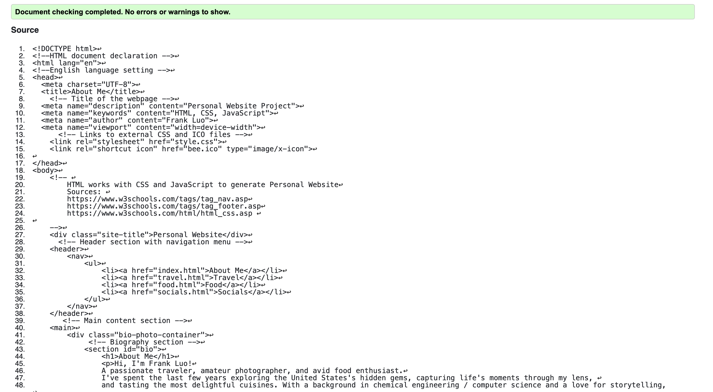
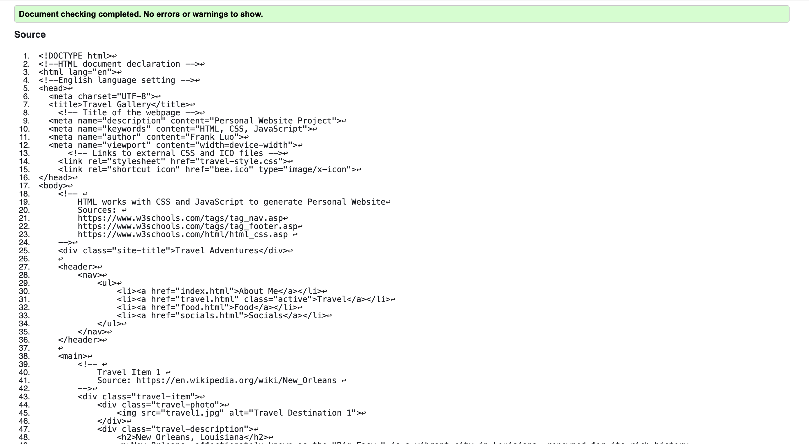
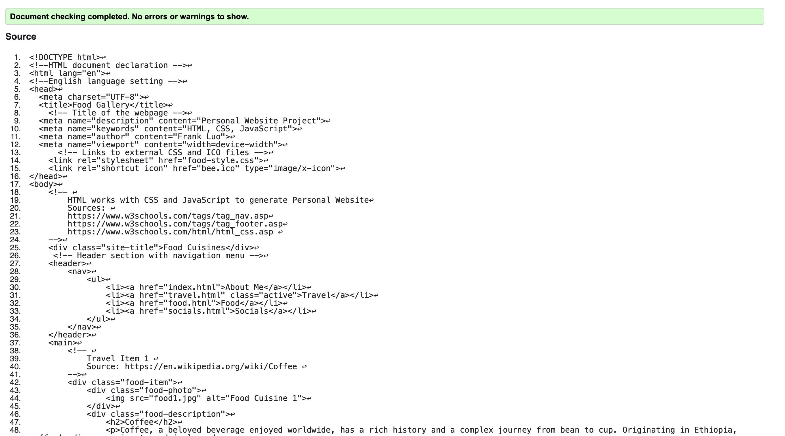
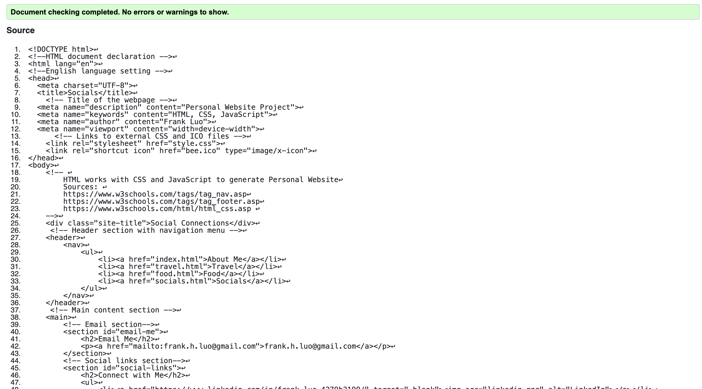
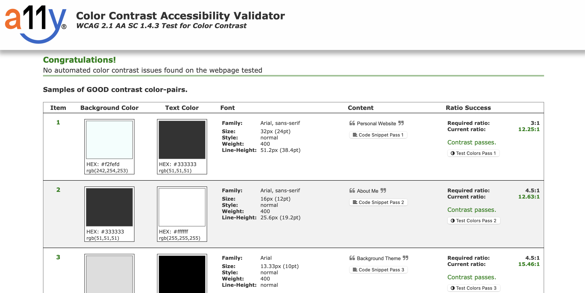
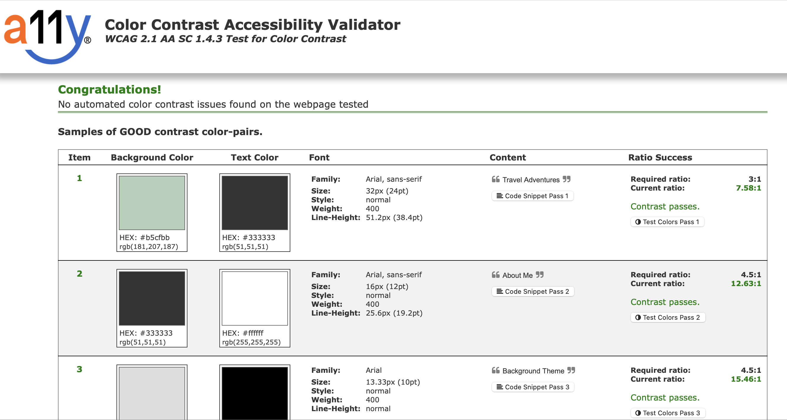
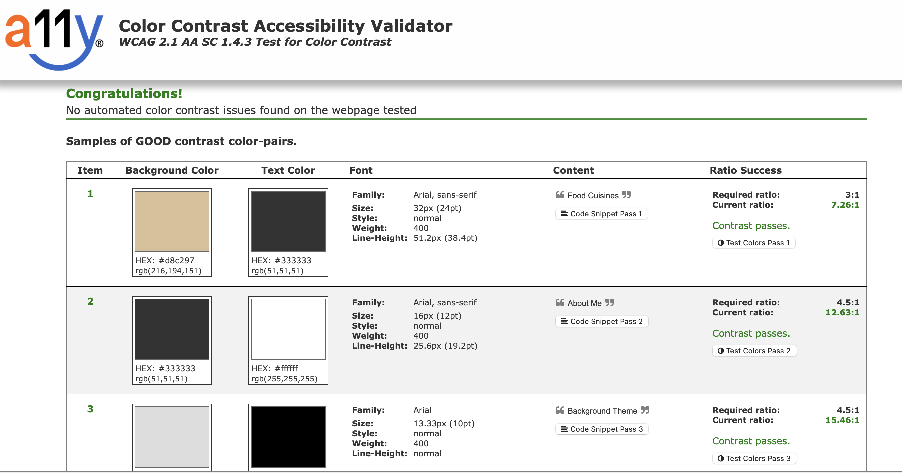
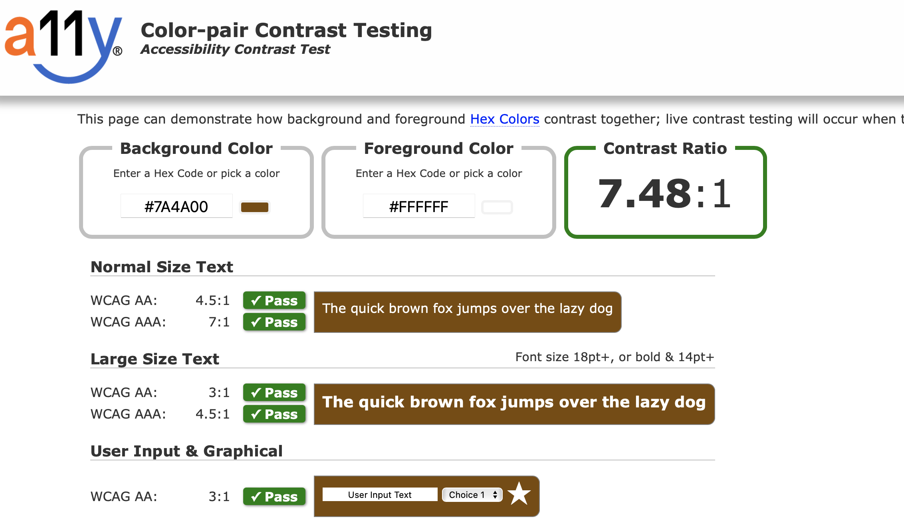
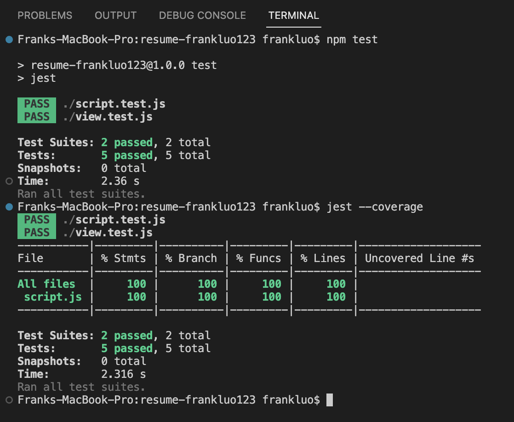

Update the README to answer the following questions:

 1. Identify the interactive JavaScript elements of your website and explain how you implemented them.
    
    The user is able to alter the background color as well as the font of the text on the website. In the JavaScript file a toggleTheme function as well as a toggleFont function is used to do this. Two buttons are created on the HTML page that triggers the functions when pressed with the mouse or certain keys on the keyboard are pressed. The dark theme is also tied with the CSS that sets the properties. In conclusion, the JavaScript, HTML, and CSS all work together to make the interactive elements work on the website.

 2. What specific feedback did the career services people give you about your resume?
    
    They recommended that I put a skills section that listed all the compute science languages I know as well as a course section that lists all the computer science courses I have taken so far. 

 3. What aspects of this project did you find particularly challenging and why? Explain how you overcame them.
   
    I found figuring out the layout of the website a bit challenging at first because I didn't know what direction I wanted to take it. After I sat down and brainstormed a bit, it became a lot more clear of how I wanted the website to look and I was able to code more efficiently. Also the interactive elements were hard to implement, and I had to research how to make the JavaScript, HTML, and CSS work with one another. 

 4. Explain how you created a custom favicon for your page.
   
   I was able to draw and create a png file of a bee. I was then able to use an online converter and create a ICO file from the imported png file. 

 5. Write a short essay about what you've learned in this class so far. Think about all the technologies we've used, the activities you've done, the programs you've made, and how far you've come. Describe your experiences in at least 20 sentences with specific examples from this course.

    I have learned so much concerning web development this semester! In the beginning, I learned about the basics of HTML and JavaScript. My knowledge was made more compact through the temperature, cycles, and herpetology assignments. I also learned about CSS and how to implement it with HTML. Afterwards, we learned about APIs and how different software systems can communicate with one another. I was able to learn a lot through the pickyourownapi assignment. It was extremely fun making a President Name Checker game through the use of APIs. We also learned about Express.js and how it streamlines the process of writing server-side code and simplifies the routing and handling of HTTP requests and responses. We also learned how to convert HTML to pug and work with that as well. In addition we learned about MongoDB - a popular NoSQL database known for its scalability, flexibility, and efficient handling of large volumes of data. The various assignments such as simpleform, mockingpug, and simpledb really helped let us put into application of what we learned. There were also neat visualization tools such as D3 that we used in the heathrow assignment that allowed us to create a linear regression line. During this course we also worked with teammates for an express project that was related to writing bubble tea reviews. It was really cool seeing how teamwork could create something really robust and meaningful. My teammates and I leanred to work with github together and talk about our ideas with one another. We are currently learning "React" in class, and we just got assigned to do a Personal Website Project. It's been fun implementing different layouts for the website, and creating interactive features for the users. Another really useful skill I learned in this class was learning how to write jest and puppeteer test cases for my functions that allowed my program to be more stable. All in all, I've really enjoyed this class and learned a lot through my time here. I would definitely recommend it to people who are looking for a computer science elective to try out.